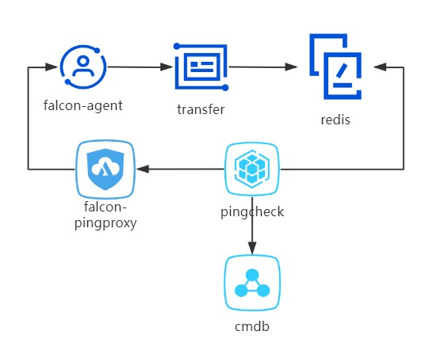

# falcon-pingcheck

## 架构  

# pingcheck  

## 功能说明 

> 1. 支持 falcon-agent 检测   
> 1.1 物理机 falcon-agent 每分钟上报 agent.avlice 至 transfer   
> 1.2 transfer 转发 agent.alive 至 redis  
> 1.3 cmdb 中物理机，vm, 默认 monitor_type = 1 (需要falcon-agent)  
> 1.4 通过 redis 验证服务器是否上报 falcon-agent 信息  
> 1.5 pingcheck 通过检测 redis 判断 falcon-agent 是否故障, 没有启动 falcon-agent  
> 1.6 暂定一天检测一次故障 falcon-agent      
> 2. 支持 ping 检测  
> 2.1 falcon-agent 故障时，对物理机进行检测   
> 2.2 支持 cmdb 中所有 monitor_type != 1(falcon), 5(不可ping) 所有设备 (物理机,vm,特殊设备)      
> 2.3 cmdb 中被过滤的 DBA 服务器  
> 2.4 利用 (gd15|gd16|gd17)-falcon-pingproxy.vip.vip.com 对其执行 ping 操作   
> 2.5 任意一个机房 ping ok 则 ping ok, 三个机房 ping false 则 ping false   
> 2.4 对上述服务器每小时 ping 一次      
