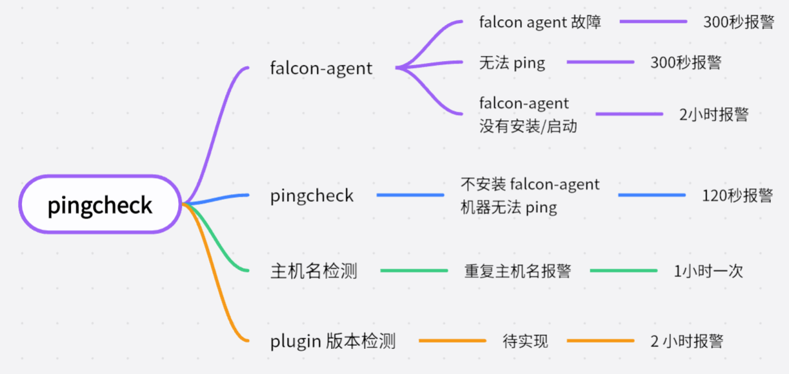
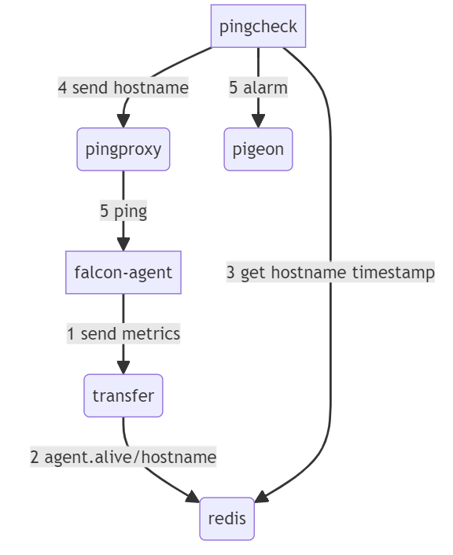
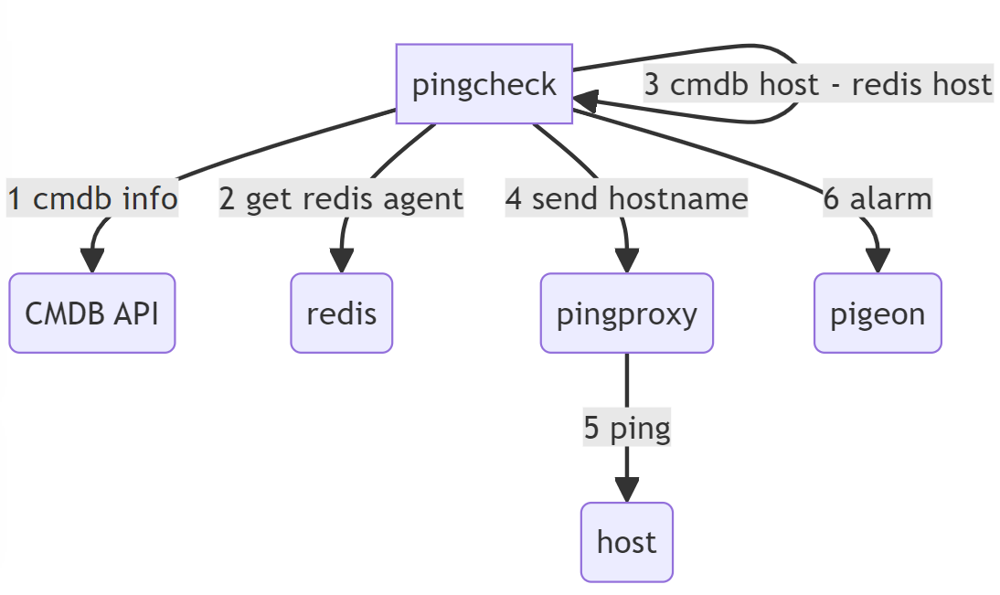
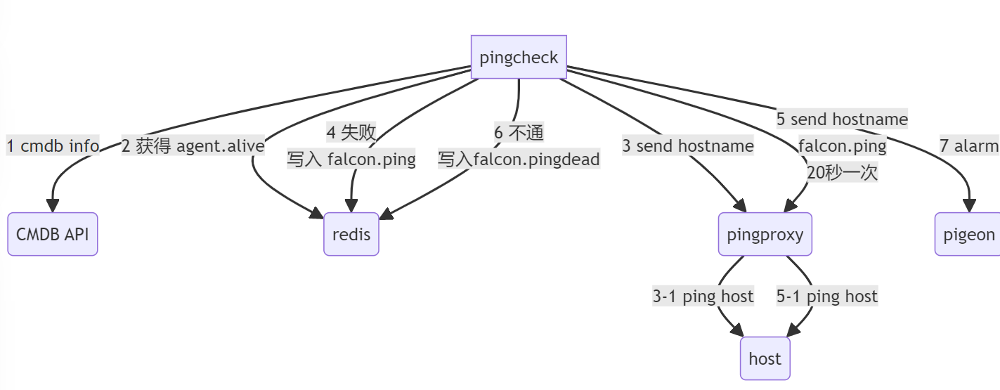
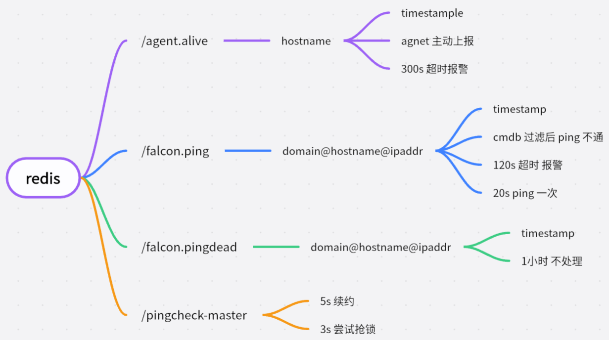
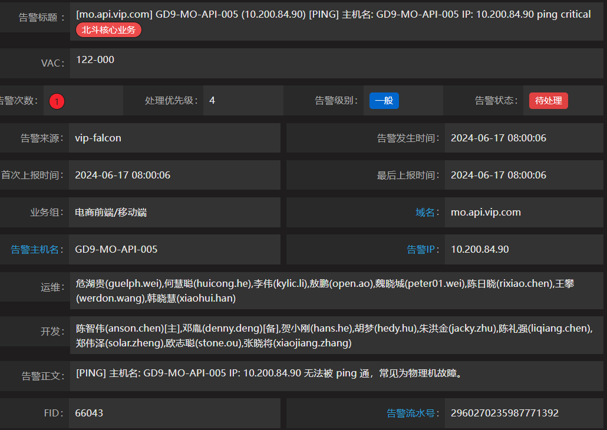
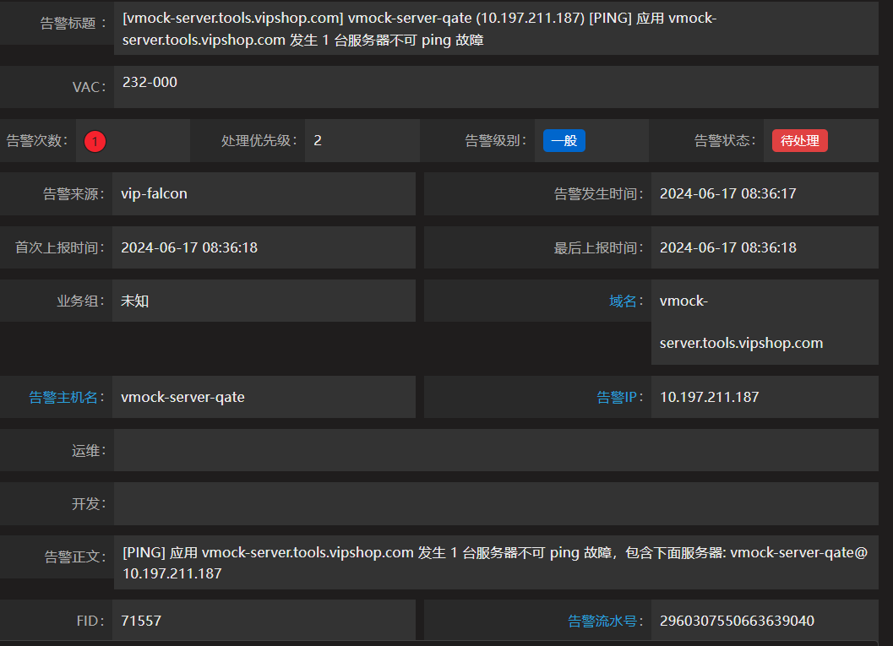
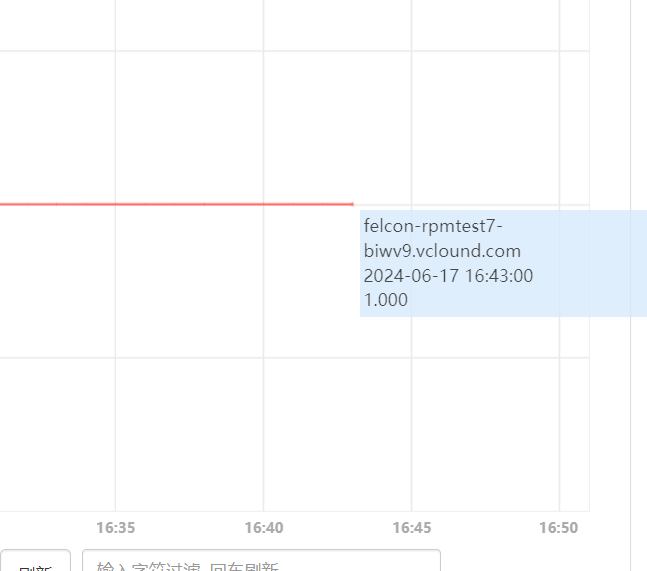
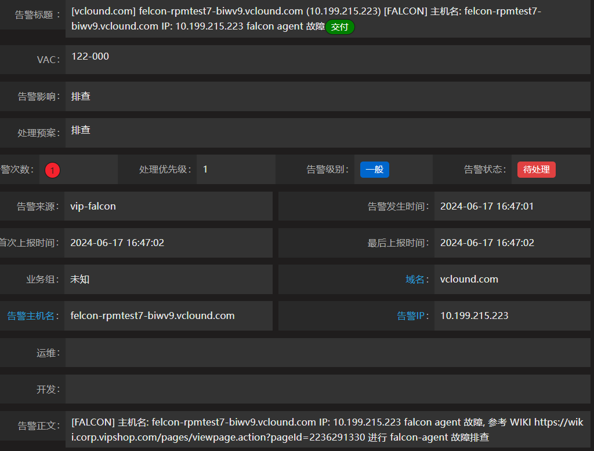
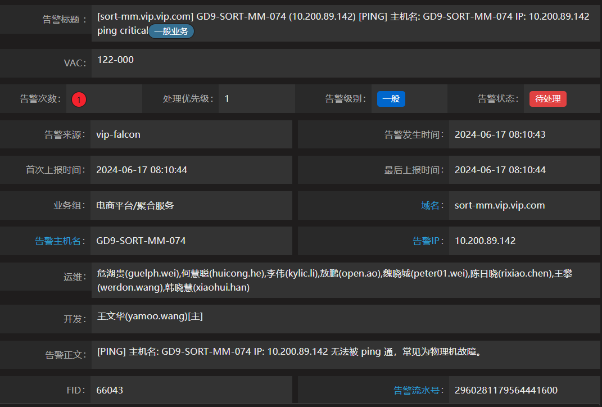

# falcon-pingcheck

- 用于取缔 nagios 功能
- nagios 主要对服务器网络 ping 执行检测
- 默认服务器都需要通过利用 falcon-agent 进行监控
- 支持 vm, 常规物理机 (特殊设备部分支持)
- 支持任意操作系统 （第三方系统除外）
- 用于检测 falcon-agent 健康状态
- 特殊情况下，对全网服务器（除 falcon-agent 安装）检测 ping 健康状态


## 整体功能



## 说明

| 功能 | 说明 | 检测间隔 | 报警周期 |
| -- | -- | -- | -- |
| agent 被动检测 | 1. 每分钟 falcon-agent 上报数据至 transfer <br> 2. transfer 记录 hostname/timestamp 至 redis<br>3. pingcheck 检测 redis, 300s 没有更新falcon-agent 数据<br> 4. pingcheck 检测并对故障服务器告警 (agent/ping) 故障<br> 5. 具备 20min 内 60 台服务器告警自动降级功能<br>6. 降级时间 20min | 60s | 4mins |
| agent 主动检测 | 1. 从 cmdb 获取合法物理机信息(dba 部分服务器例外)<br>2. 过滤已上报 redis 服务器<br> 3.执行(agent 被动检测 4,5,6) | 2h | |
| pingcheck 检测 | 1. 从 cmdb 获取合法物理机信息<br> 2. 过滤已上报 redis 服务器<br> 3. 利用 pingproxy 对物理机执行 ping 操作<br> 4. 记录无法 ping 服务器至 redis<br> 5. 120s 内重复每 20s  ping redis 中 pingdie 记录主机<br> 6. 对不可 ping 服务器告警<br> 7. 告警收敛，应用发生N台服务器 ping 故障<br> 8.具备 20min 内 60 台服务器告警自动降级功能<br>9. 降级时间 20min  | 60s| 1h  |
| 重复主机名检测 | 1. 从 cmdb 获取合法物理机信息<br> 2. 比较重复主机名<br> 3. 对重复主机名执行报警| 1h | 1h |

### agent 被动检测

最早期功能

#### 流程图



#### 说明

|步骤| 意图 | 备注 |
| -- | -- | -- |
| 1 | falcon agent 发送信息至 transfer | agent 上报 agent.alive  metric |
| 2 | transfer 写入 redis | 写入 上报主机名及当前 timestamp |
| 3 | pingcheck 检测 redis | 1. 检测 timestamp 是否 3 分钟之前<br> 2. 超过 3 分钟，则执行步骤 4<br>3. 不超时终止 |
| 4 | pingcheck ping 主机 | 向 pingproxy 请求 ping  |
| 5 |pingproxy ping 主机 | 1. gd15, gd16, gd17 三机房 <br>2. 一个机房 ping 通则服务器通<br>3. 三个机房失败，则 ping 故障 |
| 6 | pigeon 发送报警信息 | 可以 ping 通， 认为 falcon agent 故障并报警 (级别一般严重)<br>无法 ping 通， 认为物理机故障并报警（级别一般严重） |

### agent 主动检测


#### 流程图



#### 说明

|步骤| 意图 | 备注 |
| -- | -- | -- |
| 1 | 约两小时一次 |  |
| 2 |获取 CMDB 信息| 过滤 DBA 指定类型 redis, mysql, oracle, mc, mongo<br>必须满足下面 4 个条件<br>1. 生产机，预发布 (用途)<br>2. 上线 （状态）<br>3. 物理机，虚拟机 (主机类型)<br>4. mon_type=falcon |
| 3 | 获取 redis 信息 | 收集主机信息<br>/agent.alive<br>/falcon.pingdead<br> /falcon.ping|
| 4 | 主机过滤 | 过滤后主机需安装但未安装 falcon-agent |
| 5 | ping 没有上报 agent 主机 | 1. gd15, gd16, gd17 三机房<br>2.一个机房 ping 通则通<br>3.三个机房不通，则不通 |
| 6 | 发送 pigeon 报警 | 1. 可以 ping 通， 认为 falcon agent 故障并报警 (级别一般严重)<br>2. 无法 ping 通， 认为物理机故障并报警（级别一般严重）|


### ping 检测   

- 针对不安装 falcon-agent (ex: dba 服务器)   
- 针对无法安装 falcon-agent 特殊设备  
-  cmdb 物理机, vm, 特殊设备下可以配置监控模板 (以该值为标准)  
--  其他  
-- falcon  
-- zabbix  
-- nagios  
-- 不可ping  

#### 流程图   



#### 程序1  

| 步骤 | 功能 | 意图 | 
| -- | -- | -- |
| 1 | cmdb 获取信息 | 满足下面 4 个条件<br>- 生产机，预发布 (用途)<br>- 上线 （状态）<br>- 物理机，虚拟机 (主机类型)<br>- mon_type 不等于 不可ping <br>DBA应用<br>- 基础架构/数据库/MC<br>- 基础架构/数据库/MongoDB<br>- 基础架构/数据库/mssqlserver<br>- 基础架构/数据库/mysql<br>- 基础架构/数据库/oracle<br>- 基础架构/数据库/redis |
| 2| 获取 redis 信息<br> 删除 falcon.pingdaed 1 小时超时主机 | 获取主机信息<br>- /agent.alive<br>- /falcon.pingdead<br>- /falcon.ping |
| 3 | 请求 pingproxy | 对上面主机执行 ping 操作 | 
| 4 | pingproxy ping 操作 | 1. gd15, gd16, gd17 三机房<br>2.一个机房 ping 通则通<br>3.三个机房不通，则不通 |
| 5 | 写入 redis | 对无法 ping 服务器写入 /falcon.ping |

#### 程序2

| 步骤 | 功能 | 意图 | 
| -- | -- | -- |
| 1 | 读 redis<br>20s 一次 | 1.从 /falcon.ping 获取主机<br>2. timestamp 120s 超时则 ping 报警<br>3. 报警优化<br>- domain 当前 N 台服务器 ping dead  | 
| 2 | pingproxy 请求 | |
| 3 | pingproxy ping 操作 |1. gd15, gd16, gd17 三机房<br>2.一个机房 ping 通则通<br>3.三个机房不通，则不通<br>4. ping 通则 删除 /falcon.ping |


### 主机名检测

- 主机名重复则导致 pigeon 误报  
- 只报警至 cmdb 搜索到的任意第一个应用  

| 步骤 | 功能| 意图 |
| -- | -- | -- |
| 1 | 获取 cmdb 信息 | |
| 2 | 检测重复主机名字 | |
| 3 | 对重复主机名执行报警| | 

### plugin 检测(todo)  

- agent 版本过低  
- plugin 没有完成自动更新  

| 步骤 | 功能| 意图 |
| -- | -- | -- |
| 1 | 获取 version | http://falcon-pinglu.vip.vip.com  获取 version |
| 2 | 获取过期 plugin  | 1. version > 3 (1,2 windows<br>2. plugin_verson 不支持自动更新<br> 3. plugin timestamp 超过 4 天 |
| 3 | cmdb 验证主机 | 1. 过滤 sa 维护，下线服务器<br>2. mon_type=falcon |
| 4 | pigeon 告警 | falcon-agent 版本升级通知 |

### 清理废弃 host(todo) 

- 对 falcon db 废弃主机执行清理


# redis 使用方法说明  

### redis 图例  



### 说明   

| 目录 | 记录 | 说明 |  
| --| -- | --| 
| /agent.alive | hostname | 1. value 记录 timestamp<br>2.由 agent 上报后 transfer 写入<br> 3. 300s 超时(后续优化) | 
| /falcon.ping | domain@hostname@ipaddr| 1. value 记录 timestamp<br>2.数据来源 cmdb<br>3.每20s ping 一次，通则删除<br>4.120s 超时 ping 故障报警  |
| /falcon.pingdead | domain@hostname@ipaddr|1. value 记录 timestamp<br>2. 1小时超时删除<br>3. 意图，不做任何操作 |
| /pingcheck-master| 抢占锁定<br>只有 master 检测 ping  | 1. 占锁则 master 无锁则 slave<br>2. master 每秒续约 5s<br>3. slave每 3s 请求抢锁一次<br>4. master 故障切换最长 3s||


# 报警 example   

## degarded log  

1. 每次检测 39 服务器    
2. 有 7 个服务器无法 ping (屏蔽检测 1 小时)    
3. 测试:  20 分钟 6 个报警会触发自动降级

```
[2024-06-17 12:53:00.412] [DEBUG] [5357] [commands.go:33] >>> [falcon-pingcheck] msg=[PING] 39 hosts
[2024-06-17 12:53:00.418] [DEBUG] [5357] [commands.go:33] >>> [falcon-pingcheck] msg=[PING END] at 2024-06-17 12:53:00
[2024-06-17 12:53:00.418] [DEBUG] [5357] [commands.go:33] >>> [falcon-pingcheck] msg=[PING CHECK] 在 20 分钟内，发生了
 7 台服务器无法 ping 检测, 当前降级设定为 false
[2024-06-17 12:54:00.464] [DEBUG] [5357] [commands.go:33] >>> [falcon-pingcheck] msg=[PING] 34 hosts
[2024-06-17 12:55:00.509] [DEBUG] [5357] [commands.go:33] >>> [falcon-pingcheck] msg=[PING] 34 hosts
[2024-06-17 12:56:00.558] [DEBUG] [5357] [commands.go:33] >>> [falcon-pingcheck] msg=[PING] 34 hosts
....
....
[2024-06-17 13:53:00.296] [DEBUG] [5357] [commands.go:33] >>> [falcon-pingcheck] msg=[PING] 34 hosts
[2024-06-17 13:54:00.34] [DEBUG] [5357] [commands.go:33] >>> [falcon-pingcheck] msg=[PING] 36 hosts
[2024-06-17 13:55:00.39] [DEBUG] [5357] [commands.go:33] >>> [falcon-pingcheck] msg=[PING] 38 hosts
[2024-06-17 13:56:00.435] [DEBUG] [5357] [commands.go:33] >>> [falcon-pingcheck] msg=[PING] 39 hosts
[2024-06-17 13:56:00.435] [DEBUG] [5357] [commands.go:33] >>> [falcon-pingcheck] msg=[PING] 39 hosts
[2024-06-17 13:56:00.436] [DEBUG] [5357] [commands.go:33] >>> [falcon-pingcheck] msg=[PING END] at 2024-06-17 13:56:00
[2024-06-17 13:56:00.436] [DEBUG] [5357] [commands.go:33] >>> [falcon-pingcheck] msg=[PING CHECK] 在 20 分钟内，发生了
 7 台服务器无法 ping 检测, 当前降级设定为 false
...
...
[2024-06-17 14:59:00.455] [DEBUG] [5357] [commands.go:33] >>> [falcon-pingcheck] msg=[PING] 39 hosts
[2024-06-17 14:59:00.455] [DEBUG] [5357] [commands.go:33] >>> [falcon-pingcheck] msg=[PING END] at 2024-06-17 14:59:00
[2024-06-17 14:59:00.455] [DEBUG] [5357] [commands.go:33] >>> [falcon-pingcheck] msg=[PING CHECK] 在 20 分钟内，发生了
 7 台服务器无法 ping 检测, 当前降级设定为 false
```

## agent ping critical

1. 对全网 cmdb 服务器检测 falcon-agent 检测   



## just ping critical 



每分钟执行一次 ping 

```
[2024-06-17 13:45:00.921] [DEBUG] [5357] [commands.go:33] >>> [falcon-pingcheck] msg=[PING] 34 hosts
[2024-06-17 13:46:00.971] [DEBUG] [5357] [commands.go:33] >>> [falcon-pingcheck] msg=[PING] 34 hosts
[2024-06-17 13:47:00.019] [DEBUG] [5357] [commands.go:33] >>> [falcon-pingcheck] msg=[PING] 35 hosts
[2024-06-17 13:48:00.066] [DEBUG] [5357] [commands.go:33] >>> [falcon-pingcheck] msg=[PING] 34 hosts
[2024-06-17 13:49:00.114] [DEBUG] [5357] [commands.go:33] >>> [falcon-pingcheck] msg=[PING] 36 hosts
[2024-06-17 13:50:00.158] [DEBUG] [5357] [commands.go:33] >>> [falcon-pingcheck] msg=[PING] 34 hosts
[2024-06-17 13:51:00.204] [DEBUG] [5357] [commands.go:33] >>> [falcon-pingcheck] msg=[PING] 35 hosts
[2024-06-17 13:52:00.254] [DEBUG] [5357] [commands.go:33] >>> [falcon-pingcheck] msg=[PING] 37 hosts
[2024-06-17 13:53:00.296] [DEBUG] [5357] [commands.go:33] >>> [falcon-pingcheck] msg=[PING] 34 hosts
[2024-06-17 13:54:00.34] [DEBUG] [5357] [commands.go:33] >>> [falcon-pingcheck] msg=[PING] 36 hosts
[2024-06-17 13:55:00.39] [DEBUG] [5357] [commands.go:33] >>> [falcon-pingcheck] msg=[PING] 38 hosts
[2024-06-17 13:56:00.435] [DEBUG] [5357] [commands.go:33] >>> [falcon-pingcheck] msg=[PING] 39 hosts
[2024-06-17 13:57:00.479] [DEBUG] [5357] [commands.go:33] >>> [falcon-pingcheck] msg=[PING] 34 hosts
[2024-06-17 13:58:00.516] [DEBUG] [5357] [commands.go:33] >>> [falcon-pingcheck] msg=[PING] 34 hosts
[2024-06-17 13:59:00.561] [DEBUG] [5357] [commands.go:33] >>> [falcon-pingcheck] msg=[PING] 34 hosts
```

## agent alarm  

1. agent_expire: 180   
2. 2024-06-17 16:43:00 (最后上报时间)   



2024-06-17 16:47:02 (报警时间)   

 

## hostname replicate 



报警周期 1 小时

```
[2024-06-17 08:11:03.957] [INFO] [5357] [commands.go:33] >>> [falcon-pingcheck] msg=[pigeon 返回信息] LogPigeonAlarm() id: 2960281523161939971 详细信息: [CMDB 主机名重复告警] 主机名 GD9-HAPROXY-017 IP: 10.200.52.34 发生了主机名重复问题, 与下面IP 地址主机名一致 [10.200.82.207 10.200.52.34]
[2024-06-17 09:11:20.864] [INFO] [5357] [commands.go:33] >>> [falcon-pingcheck] msg=[pigeon 返回信息] LogPigeonAlarm() id: 2960343662748778499 详细信息: [CMDB 主机名重复告警] 主机名 GD9-HAPROXY-017 IP: 10.200.52.34 发生了主机名重复问题, 与下面IP 地址主机名一致 [10.200.82.207 10.200.52.34]
[2024-06-17 10:11:52.339] [INFO] [5357] [commands.go:33] >>> [falcon-pingcheck] msg=[pigeon 返回信息] LogPigeonAlarm() id: 2960406060033654785 详细信息: [CMDB 主机名重复告警] 主机名 GD9-HAPROXY-017 IP: 10.200.52.34 发生了主机名重复问题, 与下面IP 地址主机名一致 [10.200.82.207 10.200.52.34]
[2024-06-17 11:12:18.253] [INFO] [5357] [commands.go:33] >>> [falcon-pingcheck] msg=[pigeon 返回信息] LogPigeonAlarm() id: 2960468354239315968 详细信息: [CMDB 主机名重复告警] 主机名 GD9-HAPROXY-017 IP: 10.200.52.34 发生了主机名重复问题, 与下面IP 地址主机名一致 [10.200.82.207 10.200.52.34]
[2024-06-17 12:12:32.745] [INFO] [5357] [commands.go:33] >>> [falcon-pingcheck] msg=[pigeon 返回信息] LogPigeonAlarm() id: 2960530442286546945 详细信息: [CMDB 主机名重复告警] 主机名 GD9-HAPROXY-017 IP: 10.200.52.34 发生了主机名重复问题, 与下面IP 地址主机名一致 [10.200.82.207 10.200.52.34]
```


# build request  

####  需要 go-1.18 版本以上编译,  ( redis lock needed)  
